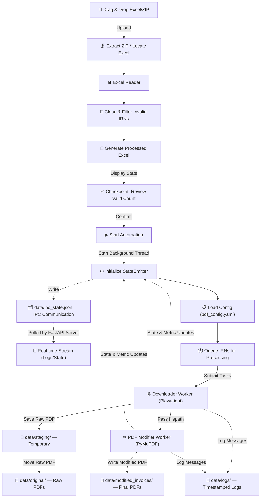

# GST Invoice Automation Pipeline - Lineage & Architecture

## Overview
The GST Invoice Automation project is an end-to-end processing pipeline built to reliably extract, download, and modify GST e-Invoices in bulk. It leverages an advanced parallel processing architecture with resilient state management and a real-time web-based UI.

## Pipeline Flow
 

 

## Implemented Features

### 1. Input Processing
- Drag-and-drop file upload interface
- Transparent ZIP extraction and Excel detection
- Batch naming support

### 2. Excel Preprocessing
- Parses unstructured client Excel sheets looking for header rows dynamically
- Filters out invalid rows by strictly validating 64-character IRN hashes
- Generates a "cleaned" working copy of the Excel sheet in `data/processed/`

### 3. PDF Downloading
- Headless Chromium browser automation via Playwright
- Stealth traversal of GST portal
- Human-like typing simulations and randomized delays to avoid rate-limiting
- Robust wait-for-element and retry mechanisms

### 4. PDF Modification (PyMuPDF)
- Absolute coordinate overlay drawing
- Dynamically reads configuration from `pdf_config.yaml`
- Injects new headers, recipient data, shipping details, and text masking
- Prevents destruction of original documents by writing outputs to `data/modified_invoices/`

### 5. Parallel Processing Architecture
- `concurrent.futures.ThreadPoolExecutor` drives the PDF modification layer
- Asynchronous separation between Downloader (IO-bound web scraping) and Modifier (CPU/IO-bound PDF manipulation)
- Seamless handover: Downloaded files are immediately dispatched to modification workers

### 6. Human-in-the-Loop & State Management
- **Checkpointing**: Pauses after Excel preprocessing for manual validation before executing expensive downstream operations.
- **IPC State Sync**: Utilizes JSON files (`ipc_state.json`) and SSE (Server-Sent Events) to bridge backend Python processes with the FastAPI web server.
- **Pipeline Controls**:
  - `PAUSE`: Halts new tasks while finishing current active ones.
  - `RESUME`: Continues from the exact paused index.
  - `STOP` / `CANCEL`: Graceful and forced termination with child-process cleanup.

### 7. UI & UX Features
- Glassmorphism dark-mode aesthetics
- Real-time embedded terminal streaming logs
- Live pipeline state representation (Downloader/Modifier worker cards)
- Throughput and metric counters (Success/Errors/Total)
- Responsive configuration editor for `pdf_config.yaml` inside the UI

### 8. Resilience & Recovery
- Automatic failure tracking: Fails are appended to `data/processed/<batch>/failed_irns.txt`
- "Retry Failed IRNs" button directly on UI to re-run only failed records
- Robust cleanup routines that destroy leftover staging files upon cancellation or process faults.

## Directory Structure
- `assets/` - Static assets required for processing (e.g. `helvmn.ttf`).
- `config/` - Configuration settings, including `requirements.txt` and `pdf_config.yaml`.
- `data/` - Entire runtime workspace (Uploads, Staging, Output, Logs, State).
- `docs/` - System documentation, architectures, and guides.
- `gst_downloader/` - Core Python package comprising web, processing, and utilities.
