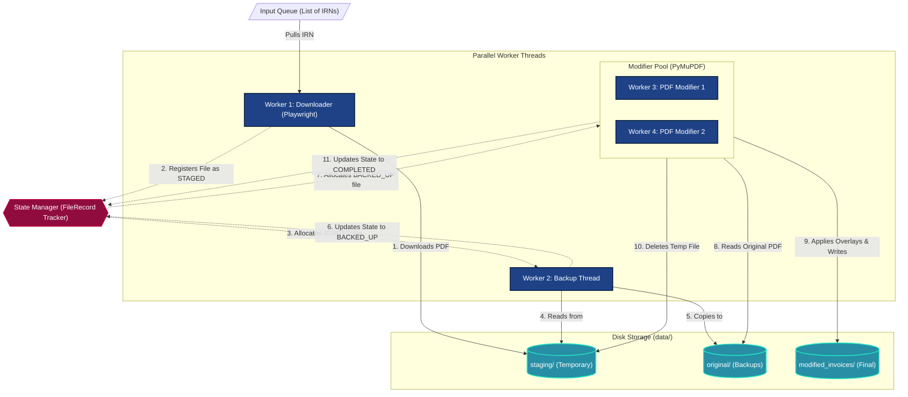

# 4-Worker Architecture

This document details the multi-threaded architecture used for processing GST invoices. The system utilizes four distinct worker threads operating in a Producer-Consumer model, synchronized via a central `StateManager`.

## Architecture Diagram

## Worker Responsibilities

1. **Worker 1 (Downloader)**: An asynchronous Playwright thread that stealthily navigates the GST portal, searches for IRNs, and downloads the raw PDF into the `staging/` directory. Once downloaded, it registers the file in the `StateManager` as `STAGED`.
2. **Worker 2 (Backup Thread)**: Continuously polls the `StateManager` for `STAGED` files. It safely copies the raw PDF from `staging/` to `original/` to prevent data loss. It then updates the state to `BACKED_UP`.
3. **Workers 3 & 4 (PDF Modifiers)**: These CPU-bound PyMuPDF threads listen for `BACKED_UP` files. They read the original PDF, apply the custom overlays/text formatting defined in `pdf_config.yaml`, and save the result to `modified_invoices/`. Finally, they delete the temporary file from `staging/` and mark the task as `COMPLETED`.
